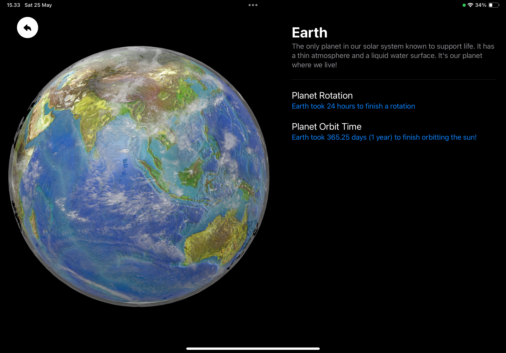

# SoLearn
An iPadOS-based AR app to help everyone learn about the solar system in an immersive and unique way.


## Screenshots

<div style="display: flex; overflow-x: auto; gap: 50px;">
  
  
  
</div>

## Features

- Interactive AR experience of the solar system
- Detailed information on planets and other celestial objects
- Engaging and educational content

## Installation

To install and run this app on your iPad, follow these steps:

1. Clone the repository
    ```bash
    git clone https://github.com/KetsunoAna117/LearnSolarSystem.git
    ```
2. Open the project in Xcode
3. Connect your iPad and select it as the run destination
4. Build and run the project

## Usage

1. Launch the app on your iPad
2. Point your iPad camera at a flat surface to initialize the AR experience
3. Explore the solar system by interacting with the 3D models of planets and celestial objects

## Authors

- [@KetsunoAna117](https://www.github.com/KetsunoAna117)

## Contributing

Contributions are welcome! Please fork the repository and create a pull request with your changes.

## Feedback

If you have any feedback, please reach out to us at hnsarthh@gmail.com
